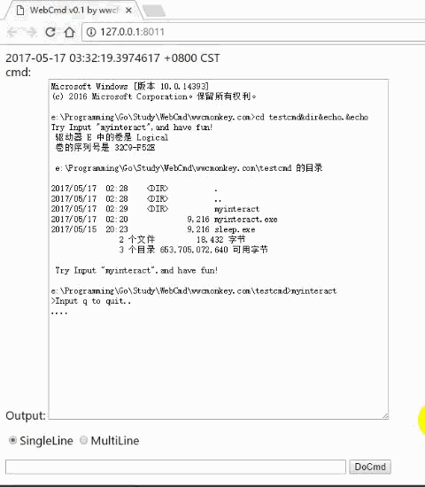

# About WebCMD 
WebCmd 允许你通过Web页面实时与本地控制台程序进行交互，获取输出并显示。 
纯属本人熟悉go语言的练手小作品。

使用Stdin/out pipe与本地控制台程序交互，异步输入输出。
输出通过HTML5的WebSocket推送给浏览器
    by wwcMonkey( https://github.com/wwc7654321)
    

# Install
go get github.com/wwc7654321/WebCMD

基于Go1.8 x64版本，其他版本应该也能跑，只要用到的库能在目标版本跑起来。
浏览器需支持HTML5 WebSocket
依赖以下库
go get github.com/astaxie/beego/session
go get github.com/axgle/mahonia
go get golang.org/x/net/websocket
 
# LICENSE
GPL(GNU General Public License)

wwc7654321/WebCmd by wwcMonkey( https://github.com/wwc7654321)

# TODO 
练习作品，管挖不管埋
1. http分发部分仅作最简单路由策略，根据路径分别分发给多路由匹配Handler、静态页文件服务器Handler、以及WebSocket Hander，
仅为了了解最近比较火的路由模式是怎么工作的。

2. 源码中封装的cmdmgr.CmdSession 允许你批量管理多个进程交互实例，但目前webcmd仅使用了单个实例。
可以通过某标识符(如beego/session管理的sessionID)，动态建立删除cmd进程实例。 甚至结合登录系统、Windows账户管理，实现多用户隔离操作。

3. WebSocket回调输出，仅单路、无历史、无重传
